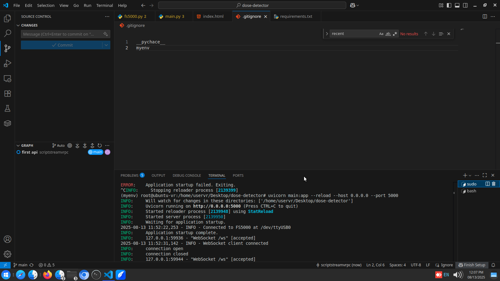
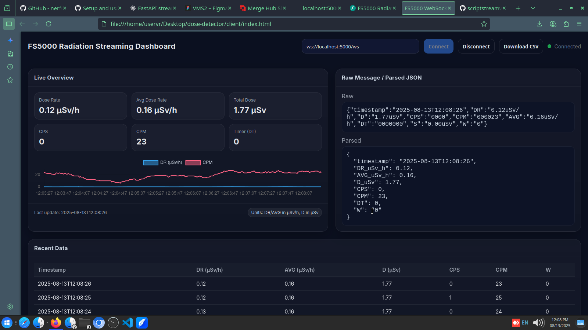

# FS5000 Radiation Detector API + WebSocket Dashboard

Proyek ini menyediakan **API HTTP** dan **WebSocket streaming** untuk membaca data dari perangkat FS5000 Radiation Detector secara real-time, serta menampilkan dashboard HTML untuk memantau dosis radiasi.

## 📦 Instalasi

```bash
# Clone repository
git clone https://github.com/scriptstreamvrpc/api-fs500-websocket
cd fs5000-api
```
# Install dependencies
```bash 
pip install fastapi uvicorn pyserial
```

# (Opsional) Gunakan mock device jika tidak ada hardware
``` bash 
export FS5000_USE_MOCK=1
```
## Menjalankan Server
```bash 
uvicorn main:app --reload --host 0.0.0.0 --port 8000
```

## Enpoint 
🔌 Endpoint API
1. Cek Kesehatan Perangkat
    GET /health
    ```bash 
    {"status": "ok"}
    ```

2. Ambil Data Dosis Terakhir
   GET /dose
   Respon Sample : 
   ```bash
   {
    "timestamp": "2025-08-13T14:22:10",
    "DR": "0.15uSv/h",
    "D": "1.63uSv",
    "CPS": "0000",
    "CPM": "000020",
    "AVG": "0.13uSv/h",
    "DT": "0000000",
    "S": "0.00uSv",
    "W": "0"
  }
  ```
3. Streaming Data Real-time via WebSocket
    ws://localhost:8000/ws
   Respon Contoh : 
    ```bash {
    "timestamp": "2025-08-13T14:22:10",
    "DR": "0.15uSv/h",
    "D": "1.63uSv",
    "CPS": "0000",
    "CPM": "000020",
    "AVG": "0.13uSv/h",
    "DT": "0000000",
    "S": "0.00uSv",
    "W": "0"
    }
    ```
## 🖥 Menguji API di Terminal
Cek status
curl http://localhost:8000/health

Ambil dosis terakhir
curl http://localhost:8000/dose

📊 Dashboard WebSocket
File fs5000-websocket-dashboard.html menyediakan UI untuk:
- Menampilkan data real-time
- Grafik tren dosis
- Tombol download CSV log data

Menjalankan Dashboard
- Pastikan API sudah berjalan di port 8000
- Buka file fs5000-websocket-dashboard.html di browser
- Klik Connect → data real-time akan muncul
